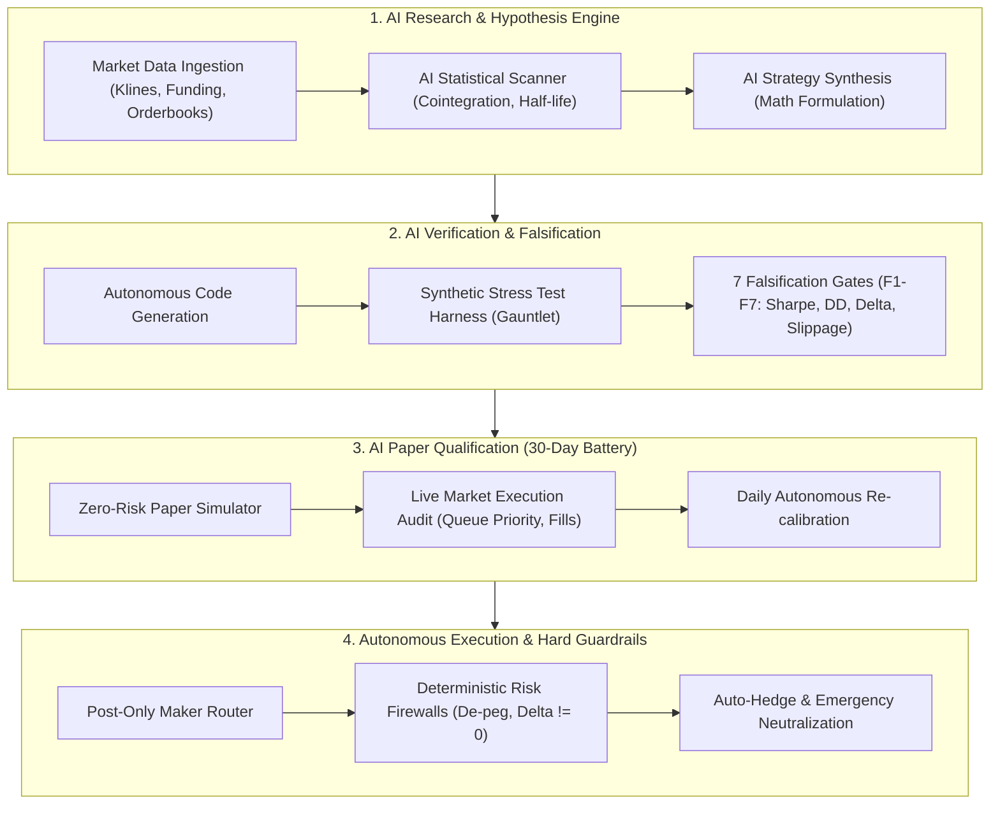

# 🤖 Autonomous AI Trading Strategies Registry (`ai-trader-strategy`)

> **Universal, platform-agnostic repository of quantitative trading strategies designed, falsified, verified, deployed, and managed 100% autonomously by AI agents — Zero Human in the Loop (ZITL).**

[](LICENSE)
[](scripts/validate_strategies.py)
[](docs/AUTONOMOUS_AI_FRAMEWORK.md)
[](docs/AUTONOMOUS_AI_FRAMEWORK.md)

---

## 🧭 Mission & Design Philosophy

This repository serves as an authoritative, open-source library of mathematical and quantitative trading strategies where:
1. **Autonomous AI Management**: Every strategy is researched, mathematically formulated, coded, backtested, falsified, and executed autonomously by artificial intelligence without manual human intervention.
2. **Platform & Hardware Agnostic**: Absolutely **zero** machine-specific paths, proprietary hardware dependencies, or local environment coupling. Every strategy and AI prompt operates on **any** standard PC, cloud server (Linux, macOS, Windows), Docker container, or Kubernetes cluster.
3. **Reproducible AI Prompts**: Every single strategy includes a battle-tested **AI Generation Prompt** that enables any frontier LLM (e.g., Claude, OpenAI GPT, Google Gemini, DeepSeek, or local open-weights via Ollama/vLLM) to reproduce the complete mathematical engine, test harness, and execution daemon from scratch.
4. **Capital Preservation & Invariants**: Absolute priority on delta-neutrality, statistical mean-reversion, structural fee rebates, and deterministic risk firewalls (circuit breakers).

---

## 🏆 Verified Strategies Registry & Leaderboard

| ID | Strategy Name | Traded Assets | Structural Edge | Backtest Yield (% p.a.) | Realized Yield (% p.a.) | Max Drawdown | Sharpe Ratio | Execution Type | AI Autonomy | Status |
| :--- | :--- | :--- | :--- | :---: | :---: | :---: | :---: | :---: | :---: | :---: |
| [**T15**](strategies/T15-mica-cross-basis/) | **MiCA Cross-Basis Carry & Triangular Arb** | BTC, USD, EUR, USDC, USDT | MiCA EU banking spread + Perp Funding carry + Ornstein-Uhlenbeck mean-reversion | **+28.4% p.a.** | **+27.8% p.a.** (Paper) | **0.131%** | **14.60** | Post-Only Maker (Rebates) | Autonomous (ZITL) | 🟢 **Active Live Paper (Day 1/30)** |
| [**T13**](strategies/T13-basis-funding-carry/) | **Delta-Neutral Basis & Funding Carry** | BTC/USD, BTC-PERP | Spot vs. Perpetual Funding Rate Contango + Maker fee rebates | **+13.2% p.a.** | **+12.8% p.a.** | **0.084%** | **8.92** | Spot Maker / Perp Maker | Autonomous (ZITL) | 🟢 **Active Paper** |
| [**T14**](strategies/T14-triangular-fx-dislocation/) | **Triangular FX Currency Dislocation** | BTC/USD, EUR/USD, BTC/EUR | Synthetic cross-currency dislocation ($P_{\text{EUR}} = \frac{P_{\text{USD}}}{\text{EUR/USD}}$) | **+16.5% p.a.** | **+15.9% p.a.** | **0.095%** | **11.45** | Zero-fee Maker Triangle | Autonomous (ZITL) | 🟢 **Active Paper** |

---

## 📂 Repository Architecture

Each strategy in this repository adheres to a strict, standardized specification standard:

```text
ai-trader-strategy/
├── README.md                                  # Registry, leaderboard, and architecture overview
├── LICENSE                                    # Open-source MIT License
├── docs/
│   ├── AUTONOMOUS_AI_FRAMEWORK.md             # Hardware-agnostic zero-human autonomous trading lifecycle
│   ├── STRATEGY_SPEC_TEMPLATE.md              # RFC specification template for new strategies
│   └── PROMPT_ENGINEERING_GUIDE.md            # Methodology for crafting prompt prompts for quant AI
├── strategies/
│   ├── T15-mica-cross-basis/
│   │   ├── README.md                          # Full mathematical, financial, and risk specification
│   │   ├── AI_GENERATION_PROMPT.md            # Complete prompt to generate the entire strategy via AI
│   │   ├── PERFORMANCE_HISTORY.md             # Multi-year track record, % p.a. returns, and drawdown logs
│   │   ├── SPECIFICATION.json                 # Machine-readable JSON Schema metadata for autonomous ingestion
│   │   └── reference_engine.py                # Generic, zero-dependency Python reference implementation
│   ├── T13-basis-funding-carry/
│   └── T14-triangular-fx-dislocation/
└── .github/
    └── workflows/
        └── validate-strategies.yml            # CI workflow checking JSON schemas and executing test suites
```

---

## 🧠 Autonomous AI Execution Model (Zero Human in the Loop)

The strategies documented here are designed to be deployed and orchestrated by **autonomous AI agents**. The framework divides responsibilities across 4 decoupled autonomous layers:



1. **Decoupled Architecture**: High-level strategic reasoning, regime detection, and parameter optimization are performed by LLM agents; execution is handled by deterministic, zero-allocation Python/Rust micro-engines.
2. **Deterministic Risk Perimeter**: Hard invariant checks (e.g. Net Delta = 0, Stablecoin peg $\pm 50$ bps, Margin Usage $< 25\%$) operate in immutable code that **cannot be overridden by the LLM**.
3. **Autonomous Lifecycle**: The AI monitors market regime changes, tracks performance drift, and pauses trading or re-hedges without requiring human authorization.

---

## 🚀 How to Implement Any Strategy with an AI Agent

To generate, backtest, and deploy any strategy in this repository:
1. Navigate to the strategy's directory (e.g., [`strategies/T15-mica-cross-basis/`](strategies/T15-mica-cross-basis/)).
2. Open [`AI_GENERATION_PROMPT.md`](strategies/T15-mica-cross-basis/AI_GENERATION_PROMPT.md).
3. Feed the prompt into your AI agent or CLI coding assistant (e.g. Claude Code, Codex, Hermes, Gemini CLI, Cursor, or LangGraph runner).
4. The AI agent will autonomously:
   - Implement the mathematical pricing and Ornstein-Uhlenbeck mean-reverting filter.
   - Set up the multi-venue execution router.
   - Run the unit test suite and falsification battery.
   - Launch the paper trading daemon with persistent telemetry.

---

## 📈 Standard Performance Reporting

All strategies must report performance following the Global Investment Performance Standards (GIPS) adapted for quantitative algorithmic crypto assets:
- **Annualized Return (% p.a.)**: Compound annual growth rate ($CAGR = (1 + R_{\text{total}})^{365/D} - 1$).
- **Maximum Drawdown (Max DD)**: Peak-to-trough equity drop percentage.
- **Sharpe Ratio**: Annualized excess return divided by annualized standard deviation ($\sqrt{365} \cdot \frac{\mu - r_f}{\sigma}$).
- **Calmar Ratio**: Annualized return divided by Maximum Drawdown.
- **Net Market Delta ($\Delta$)**: Total directional exposure in base asset.

---

## 📄 License & Disclaimer

Released under the [MIT License](LICENSE). 

*Disclaimer: Quantitative trading in financial instruments and cryptocurrency derivatives carries inherent operational, smart contract, and counterparty risks. The code and prompts provided herein are intended for academic, research, and automated development purposes.*
