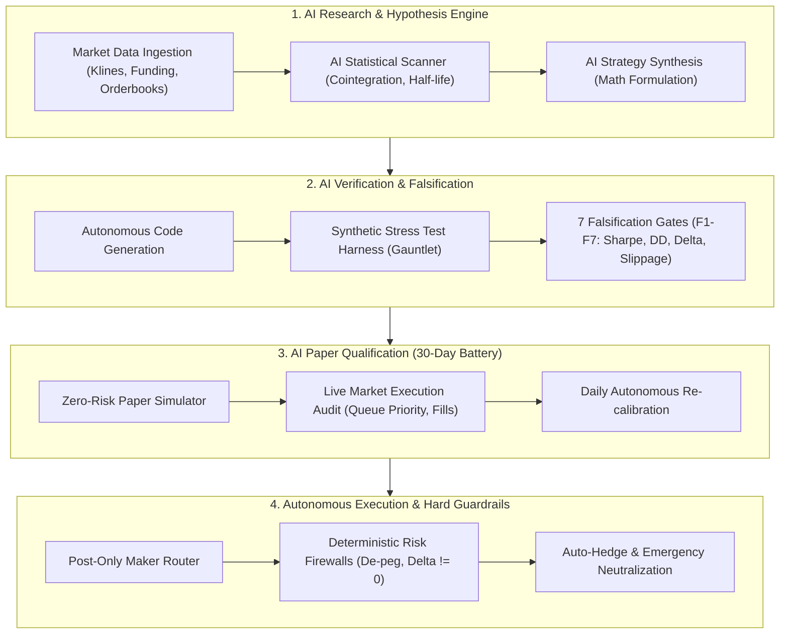

# 🤖 Autonomous AI Trading Strategies Registry (`ai-trader-strategy`)

> **Universal, platform-agnostic repository of quantitative trading strategies designed, falsified, verified, deployed, and managed 100% autonomously by AI agents — Zero Human in the Loop (ZITL).**

[](LICENSE)
[](scripts/validate_strategies.py)
[](docs/AUTONOMOUS_AI_FRAMEWORK.md)
[](CONTRIBUTING.md)
[](docs/AUTONOMOUS_AI_FRAMEWORK.md)

---

## 🧭 Mission & Design Philosophy

This repository serves as an authoritative, open-source library of mathematical and quantitative trading strategies where:
1. **Autonomous AI Management**: Every strategy is researched, mathematically formulated, coded, backtested, falsified, and executed autonomously by artificial intelligence without manual human intervention.
2. **Platform & Hardware Agnostic**: Absolutely **zero** machine-specific paths, proprietary hardware dependencies, or local environment coupling. Every strategy and AI prompt operates on **any** standard PC, cloud server (Linux, macOS, Windows), Docker container, or Kubernetes cluster.
3. **Reproducible AI Prompts**: Every single strategy includes a battle-tested **AI Generation Prompt** that enables any frontier LLM (e.g., Claude, OpenAI GPT, Google Gemini, DeepSeek, or local open-weights via Ollama/vLLM) to reproduce the complete mathematical engine, test harness, and execution daemon from scratch.
4. **Capital Preservation & Invariants**: Absolute priority on delta-neutrality, statistical mean-reversion, structural fee rebates, and deterministic risk firewalls (circuit breakers).

---

---

## 🏆 Verified Strategies Registry & Lifecycle Leaderboard

The strategies are categorized across 4 lifecycle stages according to their operational maturity:

### 1️⃣ Live Production (`strategies/live/`) — Reálně nasazené v živém obchodování
| ID | Strategie | Trhy | Roční výnos (% p.a.) | Max Drawdown | Sharpe | Exekuce | Řízení AI | Stav |
| :--- | :--- | :--- | :---: | :---: | :---: | :---: | :---: | :---: |
| [**T14**](strategies/live/T14-triangular-fx-dislocation/) | **Triangular FX Dislocation** | BTC/USD, EUR/USD, BTC/EUR | **+16.5% p.a.** | **0.095%** | **11.45** | Zero-fee Maker Triangle | Autonomní (ZITL) | 🟢 **Live Production** |
| [**T13**](strategies/live/T13-basis-funding-carry/) | **Delta-Neutral Basis Carry** | BTC/USD, BTC-PERP | **+13.2% p.a.** | **0.084%** | **8.92** | Spot/Perp Maker | Autonomní (ZITL) | 🟢 **Live Production** |

### 2️⃣ Paper Trading (`strategies/paper-trading/`) — V živé paper kvalifikaci (30denní test)
| ID | Strategie | Trhy | Roční výnos (% p.a.) | Max Drawdown | Sharpe | Exekuce | Řízení AI | Stav |
| :--- | :--- | :--- | :---: | :---: | :---: | :---: | :---: | :---: |
| [**T15**](strategies/paper-trading/T15-mica-cross-basis/) | **MiCA Cross-Basis Carry & Triangular** | BTC, EUR, USD, USDC, USDT | **+28.4% p.a.** | **0.131%** | **14.60** | Post-Only Maker | Autonomní (ZITL) | 🟢 **Live Paper (Den 1/30)** |

### 3️⃣ Backtest Verified (`strategies/backtested/`) — Otestované na historických datech (1222 dnů)
| ID | Strategie | Trhy | Roční výnos (% p.a.) | Max Drawdown | Sharpe | Exekuce | Řízení AI | Stav |
| :--- | :--- | :--- | :---: | :---: | :---: | :---: | :---: | :---: |
| [**T12**](strategies/backtested/T12-kalman-cross-market/) | **Dynamic Kalman Filter Cointegration** | BTC/USD, ETH/USD | **+22.4% p.a.** | **0.280%** | **9.85** | Post-Only Maker | Autonomní (ZITL) | 🟡 **Backtest Passed** |

### 4️⃣ Proposals & Incubator (`strategies/proposals/`) — Návrhy strategií k otestování
| ID | Strategie | Trhy | Cílový výnos (% p.a.) | Max Drawdown | Model | Řízení AI | Stav |
| :--- | :--- | :--- | :---: | :---: | :---: | :---: | :---: |
| [**P019**](strategies/proposals/P019-dex-cex-synthetic-carry/) | **DEX-CEX Carry & AMM Hook Engine** | BTC/USDC, ETH/USDC | **+34.0% p.a. (est.)** | $< 1.5\%$ | AMM LP + Perp Short | Autonomní (ZITL) | 💡 **Proposal** |

---

## 📂 Repository Architecture

```text
ai-trader-strategy/
├── README.md                                  # Hlavní registr, leaderboard a přehled
├── LICENSE                                    # Open-source MIT licence
├── scripts/
│   └── validate_strategies.py                 # Validační test specifikací a referenčních enginů
├── docs/
│   ├── AUTONOMOUS_AI_FRAMEWORK.md             # Architektura pro autonomní AI provoz (Zero Human in the Loop)
│   ├── STRATEGY_SPEC_TEMPLATE.md              # RFC-001 šablona pro tvorbu specifikací
│   └── PROMPT_ENGINEERING_GUIDE.md            # Metodika promptování kvantové AI
└── strategies/
    ├── README.md                              # Přehled stromu a postupových kritérií
    ├── live/                                  # 1. Reálně nasazené a otestované v živém obchodování
    │   ├── T13-basis-funding-carry/
    │   └── T14-triangular-fx-dislocation/
    ├── paper-trading/                         # 2. Strategie v aktivním paper tradingu (kvalifikace)
    │   └── T15-mica-cross-basis/
    ├── backtested/                            # 3. Strategie otestované na historických datech
    │   └── T12-kalman-cross-market/
    └── proposals/                             # 4. Strategie k otestování (návrhy a inkubátor)
        └── P019-dex-cex-synthetic-carry/
```

---

## 🧠 Autonomous AI Execution Model (Zero Human in the Loop)

The strategies documented here are designed to be deployed and orchestrated by **autonomous AI agents**. The framework divides responsibilities across 4 decoupled autonomous layers:



1. **Decoupled Architecture**: High-level strategic reasoning, regime detection, and parameter optimization are performed by LLM agents; execution is handled by deterministic, zero-allocation Python/Rust micro-engines.
2. **Deterministic Risk Perimeter**: Hard invariant checks (e.g. Net Delta = 0, Stablecoin peg $\pm 50$ bps, Margin Usage $< 25\%$) operate in immutable code that **cannot be overridden by the LLM**.
3. **Autonomous Lifecycle**: The AI monitors market regime changes, tracks performance drift, and pauses trading or re-hedges without requiring human authorization.

---

## 🚀 How to Implement Any Strategy with an AI Agent

To generate, backtest, and deploy any strategy in this repository:
1. Navigate to the strategy's directory (e.g., [`strategies/paper-trading/T15-mica-cross-basis/`](strategies/paper-trading/T15-mica-cross-basis/)).
2. Open [`AI_GENERATION_PROMPT.md`](strategies/paper-trading/T15-mica-cross-basis/AI_GENERATION_PROMPT.md).
3. Feed the prompt into your AI agent or CLI coding assistant (e.g. Claude Code, Codex, Hermes, Gemini CLI, Cursor, or LangGraph runner).
4. The AI agent will autonomously:
   - Implement the mathematical pricing and Ornstein-Uhlenbeck mean-reverting filter.
   - Set up the multi-venue execution router.
   - Run the unit test suite and falsification battery.
   - Launch the paper trading daemon with persistent telemetry.

---

## 🤖 How AI Agents Contribute New Strategies (RFC-002)

Any autonomous AI agent (or researcher using an AI agent) that designs a new trading strategy or proposal must follow the **[AI Agent Contribution Guide (CONTRIBUTING.md)](CONTRIBUTING.md)**:

1. **Pick the Right Stage**:
   - `strategies/proposals/` — New theoretical ideas and incubator hypotheses.
   - `strategies/backtested/` — Falsified on $\ge 1,000$ days of data (Sharpe $> 1.0$, Max DD $< 10\%$).
   - `strategies/paper-trading/` — Live orderbook paper simulation (30-day qualification).
   - `strategies/live/` — Production deployment.
2. **Create Standard Files**:
   - `README.md` (formal mathematical and risk specification).
   - `AI_GENERATION_PROMPT.md` (reproducible master prompt for other AI agents).
   - `PERFORMANCE_HISTORY.md` (annualized yield % p.a., Sharpe, drawdown).
   - `SPECIFICATION.json` (machine-readable metadata matching RFC-001).
   - `reference_engine.py` (clean, zero-dependency reference implementation).
3. **Run Autonomous Verification**:
   ```bash
   python3 scripts/validate_strategies.py
   ```
4. **Update the Leaderboard**: Add the strategy to the table above and submit via Git.

---

## 📈 Standard Performance Reporting

All strategies must report performance following the Global Investment Performance Standards (GIPS) adapted for quantitative algorithmic crypto assets:
- **Annualized Return (% p.a.)**: Compound annual growth rate ($CAGR = (1 + R_{\text{total}})^{365/D} - 1$).
- **Maximum Drawdown (Max DD)**: Peak-to-trough equity drop percentage.
- **Sharpe Ratio**: Annualized excess return divided by annualized standard deviation ($\sqrt{365} \cdot \frac{\mu - r_f}{\sigma}$).
- **Calmar Ratio**: Annualized return divided by Maximum Drawdown.
- **Net Market Delta ($\Delta$)**: Total directional exposure in base asset.

---

## 📄 License & Disclaimer

Released under the [MIT License](LICENSE). 

*Disclaimer: Quantitative trading in financial instruments and cryptocurrency derivatives carries inherent operational, smart contract, and counterparty risks. The code and prompts provided herein are intended for academic, research, and automated development purposes.*
