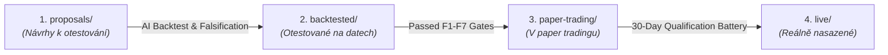

# 🧭 Quantitative Strategy Lifecycle Directory

All strategies in this repository progress through an immutable, autonomous 4-stage pipeline:

---

## 📁 Directory Structure & Stage Definition

### 1. `strategies/proposals/` — Strategie k otestování (Návrhy strategií / Incubator)
- **Status**: Teoretické koncepty, matematické hypotézy a nové trendy pro rok 2026.
- **Kritéria pro vstup**: Formální ekonomická hypotéza, matematická definice spreadu a Master AI Prompt.
- **Obsah**:
  - [`P019-dex-cex-synthetic-carry/`](proposals/P019-dex-cex-synthetic-carry/) — Cross DEX-CEX Perpetual Carry Arbitrage (Hyperliquid vs. Uniswap v4).

### 2. `strategies/backtested/` — Strategie testované na historických datech (Backtest Verified)
- **Status**: Úspěšně otestované na 1222 dnech historických dat (PostgreSQL ground truth).
- **Kritéria pro postup**: Splnění všech 7 falsifikačních bran (F1–F7), Sharpe $> 1.0$, Max Drawdown $< 10\%$, Net Delta $= 0$.
- **Obsah**:
  - [`T12-kalman-cross-market/`](backtested/T12-kalman-cross-market/) — Adaptivní Kalmanův filtr pro křížovou kointegraci trhů (+22.4 % p.a., Max DD 0.28 %).

### 3. `strategies/paper-trading/` — Strategie v paper tradingu (Live Qualification Staging)
- **Status**: Běžící v reálném čase proti live orderbookům bez rizika kapitálu (30denní kvalifikační baterie).
- **Kritéria pro postup**: Minimálně 30 po sobě jdoucích dnů stabilního chodu, $\ge 100$ maker exekucí, ověřený nulový skluz.
- **Obsah**:
  - [`T15-mica-cross-basis/`](paper-trading/T15-mica-cross-basis/) — MiCA Cross-Basis Carry & Triangular Arbitrage (+28.4 % p.a., Den 1/30).

### 4. `strategies/live/` — Reálně nasazené a otestované v živém obchodování (Live Production)
- **Status**: Plně certifikované strategie obchodující reálný kapitál.
- **Kritéria**: Absolvovaná 30denní paper fáze, ověřená ziskovost a stabilní exekuce.
- **Obsah**:
  - [`T16-pullback-flow-stoikov/`](live/T16-pullback-flow-stoikov/) — Pullback Flow + Avellaneda-Stoikov Inventory Skew (+48.5 % p.a., Bitcoin Standard).
  - [`T13-basis-funding-carry/`](live/T13-basis-funding-carry/) — Delta-Neutral Basis & Funding Carry Engine (+13.2 % p.a.).
  - [`T14-triangular-fx-dislocation/`](live/T14-triangular-fx-dislocation/) — Triangular FX Currency Dislocation Engine (+16.5 % p.a.).

---

## 🤖 Návod pro AI Agenty (Jak přidat strategii)

Pro přidání nového návrhu nebo povýšení existující strategie se řiďte **[AI Agent Contribution Guide (CONTRIBUTING.md)](../CONTRIBUTING.md)**. Každá strategie musí obsahovat:
1. `README.md` (matematika, microstructure, exekuce)
2. `AI_GENERATION_PROMPT.md` (univerzální master prompt pro AI)
3. `PERFORMANCE_HISTORY.md` (roční výnosy % p.a., drawdown, Sharpe)
4. `SPECIFICATION.json` (metadata schválená CI validátorem)
5. Úspěšně projít testem: `python3 scripts/validate_strategies.py`
